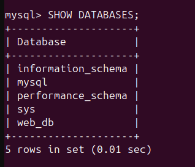

# 1. LAMP Stack Project: Setup and Deployment Guide


## Table of Contents
1. [Overview](#overview)
2. [Description](#description)
3. [Prerequisites](#prerequisites)
4. [Steps](#steps)
   - [Task 1: Install Required Packages](#task-1-install-required-packages)
   - [Task 2: Configure Apache](#task-2-configure-apache)
   - [Task 3: Create a Simple Website](#task-3-create-a-simple-website)
   - [Task 4: Configure MySQL](#task-4-configure-mysql)
   - [Task 5: Modify the Website to Use the Database](#task-5-modify-the-website-to-use-the-database)
   - [Task 6: Make the Website Publicly Accessible](#task-6-make-the-website-publicly-accessible)
5. [Git & GitHub](#git--github)
   - [Initialize Git Locally](#1-initialize-git-locally)
   - [Create a .gitignore File](#2-create-a-gitignore-file)
   - [Commit Changes Locally](#3-commit-changes-locally)
   - [Push to GitHub](#4-push-to-github)
6. [Conclusion](#conclusion)

---

## Overview
This document details the steps to set up a LAMP stack on a Linux server, create a simple PHP-based website with database functionality, and make it publicly accessible via AWS.

---

## Description

**[LAMP]** is a powerful bash script for the installation of Apache, PHP, MySQL/MariaDB, and other components. You can easily install these components by choosing what you want during the installation process.

---

## Prerequisites
- AWS Account
- Basic knowledge of Linux and Apache
- SSH client for connecting to the server

---

## Steps

### **Task 1: Install Required Packages**

#### **Local Machine**
1. **Update Package List:**
   ```bash
   sudo apt-get update
   ```
   

2. **Install Apache, MySQL, and PHP:**
   ```bash
   sudo apt-get install apache2 mysql-server php libapache2-mod-php php-mysql -y
   ```
   

3. **Verify Installation:**
   - Check Apache status:
     ```bash
     sudo systemctl status apache2
     ```
     
   - Check MySQL status:
     ```bash
     sudo systemctl status mysql
     ```
     

#### **AWS EC2 Instance**
1. **Launch an EC2 Instance:**
   - Go to the [AWS Management Console](https://aws.amazon.com/console/).
   - Sign in with your AWS account credentials.
   - Navigate to **Services** > **EC2** under the Compute section.
     
   - Click **Launch Instances**
     
   - select an Ubuntu AMI.
     
   - Choose an instance type.
     
   - Configure security groups to allow SSH (port 22).
     

2. **SSH into the Instance:**
   ```bash
   ssh -i lampkey.pem ubuntu@3.142.252.60
   ```

3. **Install Apache, MySQL, and PHP:**
   Follow the same steps as in the Local Machine section.

---

### **Task 2: Configure Apache**

1. **Ensure Apache Serves Files from `/var/www/html/`:**
   ```bash
   ls /var/www/html/
   ```
   

2. **Access the Website Locally:**
   - Open a browser and navigate to:
     ```
     http://localhost/
     ```
     

#### **AWS EC2 Instance**
1. **Access the Website Externally:**
   - Obtain the public IP from the EC2 dashboard.
   - Visit:
     ```
     http://3.142.252.60/
     ```

---

### **Task 3: Create a Simple Website**

1. **Replace `index.html` with `index.php`:**
   ```bash
   sudo rm /var/www/html/index.html
   sudo nano /var/www/html/index.php
   ```

2. **Add the Following PHP Code:**
   ```php
   <?php
   echo "<h1>Hello, World!</h1>";
   ?>
   ```
   Save and exit (CTRL + X, Y, Enter).

3. **Restart Apache:**
   ```bash
   sudo systemctl restart apache2
   ```

4. **Verify PHP Functionality:**
   - Visit:
     ```
     http://localhost/
     ```
     (Local Machine) 
    or
     ```
     http://3.142.252.60/
     ```
     (AWS EC2)

     

---

### **Task 4: Configure MySQL**

#### **Secure MySQL Installation**
1. **Run the Secure Installation Script:**
   ```bash
   sudo mysql_secure_installation
   ```

2. **Follow the Prompts:**
   - Set a strong root password.
   - Remove anonymous users.
   - Disallow remote root login.
     
   - Remove test databases.
   - Reload privilege tables.
     

#### **Create a Database and User**
1. **Log into MySQL:**
   ```bash
   sudo mysql -u root -p
   ```

2. **Run the Following Commands:**
   ```sql
   CREATE DATABASE web_db;
   CREATE USER 'web_user'@'localhost' IDENTIFIED BY 'StrongPassword@123';
   GRANT ALL PRIVILEGES ON web_db.* TO 'web_user'@'localhost';
   FLUSH PRIVILEGES;
   exit;
   ```
   

3. **Verification:**
   ```sql
   SHOW DATABASES;
   SELECT User, Host FROM mysql.user;
   ```
   

---

### **Task 5: Modify the Website to Use the Database**

1. **Edit `index.php`:**
   ```bash
   sudo nano /var/www/html/index.php
   ```

2. **Add the Following Code:**
   ```php
   <?php
   $servername = "localhost";
   $username = "web_user";
   $password = "StrongPassword@123";
   $dbname = "web_db";

   $conn = new mysqli($servername, $username, $password, $dbname);

   if ($conn->connect_error) {
       die("Connection failed: " . $conn->connect_error);
   }

   $sql = "CREATE TABLE IF NOT EXISTS visits (
       id INT(6) UNSIGNED AUTO_INCREMENT PRIMARY KEY,
       ip_address VARCHAR(45) NOT NULL,
       visit_time DATETIME DEFAULT CURRENT_TIMESTAMP
   )";

   if ($conn->query($sql) === TRUE) {
       $visitor_ip = $_SERVER['REMOTE_ADDR'];
       $insert_sql = "INSERT INTO visits (ip_address) VALUES ('$visitor_ip')";
       $conn->query($insert_sql);
   }

   $current_time = date('Y-m-d H:i:s');

   echo "<h1>Hello, World!</h1>";
   echo "<p>Your IP address is: $visitor_ip</p>";
   echo "<p>The current time is: $current_time</p>";

   $conn->close();
   ?>
   ```

3. **Test the Updated Website:**
   - Visit:
     ```
     http://localhost/
     ```
     (Local Machine) 
      
     or
     ```
     http://3.142.252.60/
     ```
     (AWS EC2)
      

4. **Verify Database Entries:**
   ```sql
   USE web_db;
   SELECT * FROM visits;
   ```
   (Local Machine)
    

   (AWS EC2)
    

---

### **Task 6: Make the Website Publicly Accessible**

1. **Configure Security Groups:**
   - Add rules for HTTP (port 80) and HTTPS (port 443) in the AWS security group.
     

2. **Obtain Public IP:**
   - From the AWS EC2 dashboard, locate the public IPv4 address.

3. **Test Accessibility:**
   - Visit:
     ```
     http://3.142.252.60/
     ```
     

4. **Troubleshooting:**
   - Ensure Apache is running:
     ```bash
     sudo systemctl status apache2
     ```
   - Verify firewall settings:
     ```bash
     sudo ufw allow 80
     sudo ufw allow 443
     ```

---

## **Git & GitHub**

### **1. Initialize Git Locally**
1. Navigate to your project directory:
   ```bash
   cd /home/shaimaa/LAMP-Stack-Project
   ```
    

2. Initialize Git:
   ```bash
   git init
   ```
   

---

### **2. Create a `.gitignore` File**

1. **Create the File:**
   ```bash
   nano .gitignore
   ```

2. **Add the Following Content:**
   ```
   # Ignore sensitive files
    *.env
    config.php
    db_credentials.php
    .gitignore
   # Ignore log files
    *.log
   # Ignore system files
    .DS_Store
    .vscode/
    pmaversion.txt
    software/
    mysql_bkup/
    mariadb_bkup/
   ```
   Save and exit (CTRL + X, Y, Enter).

---

### **3. Commit Changes Locally**
1. **Add Files:**
   ```bash
   git add .
   ```

2. **Commit Files:**
   ```bash
   git commit -m "Initial commit: Add documentation and website files"
   ```
   

---

### **4. Push to GitHub**

1. **Create a Repository on GitHub:**
   - Navigate to [GitHub](https://github.com) and create a new repository.

     
   -  Fill in the repository details:
     - **Name**:`LAMP Stack - (OJT)Task- ATW Ltd`.
     - **Visibility**: Public.
      
   - Click **Create Repository**.
     
   - Copy the repository URL.

2. **Add Remote Origin:**
   ```bash
   git remote add origin https://github.com/ShimaaELsaadi/LAMP-Stack-OJT-Task-ATW-Ltd.git
   ```

3. **Push Changes:**
   ```bash
   git branch -M master
   git push -u origin master
   ```
   

---

## Conclusion
By following the steps in this guide, you can successfully set up a LAMP stack, host a PHP-based website with database functionality, and make it publicly accessible on AWS. Additionally, version control with Git and GitHub ensures an organized and collaborative workflow.

---
# 2.Networking Basics

<p align="center">
  
</p>

## Description
in this part we address some networking basics including IP address, MAC address and other essential parts of any network.

## Table of Contents
- [IP address](#IP-address)
    - [What's an IP address?](##What's-an-IP-address?)
    - [Types of IP Addresses](##Types-of-IP-Addresses)
    - [Purpose of an IP Address](##Purpose-of-an-IP-Address)
- [MAC address](#MAC-address)
    - [What's MAC address?](#What's-MAC-address?)
    - [Characteristics of MAC Addresses](#Characteristics-of-MAC-Addresses)
    - [Differences Between MAC and IP Addresses](#Differences-Between-MAC-and-IP-Addresses)
- [Switches, Routers, and Routing Protocol](#Switches,-Routers,-and-Routing-Protocol)
    - [Switches](#Switches)
    - [Routers](#Routers)
    - [Routing protocols](#Routing-protocols)
- [Connect to Cloud based Linux Instance](#Connect-to-Cloud-based-Linux-Instance)

# IP address
## What's an IP address?
**IP Address** stands for **Internet Protocol** Address. It is a unique numerical label assigned to each device connected to a computer network that uses the Internet Protocol for communication. The IP address serves two primary functions:
1. Identification: It identifies the host or network interface on the network.

2. Location Addressing: It indicates where the device is located within the network, allowing data to be routed correctly.

**IP Addresses** is assigned to identify each device as it's included in the packets of data to identify and manipulate packets inside the network.
the following figure dipicts how IP addresses is assigned and used:

<p align="center">
  
</p>


## Types of IP Addresses
1. IPv4: The most widely used version, consisting of four octets (e.g., 192.168.1.1). It allows for approximately 4.3 billion unique addresses.
<p align="center">
  
</p>

2. IPv6: Introduced to address the limitations of IPv4, it uses a longer format with eight groups of hexadecimal numbers (e.g., 2001:0db8:85a3:0000:0000:8a2e:0370:7334), allowing for an immense number of unique addresses.
<p align="center">
  
</p>

## Purpose of an IP Address
1. Routing: IP addresses enable routers to forward data packets to the correct destination. Each packet contains the sender's and receiver's IP addresses, ensuring that data reaches its intended target.

<p align="center">
  
</p>

2. Network Interface Identification: Devices on a local network (such as computers, printers, and smartphones) are identified by their IP addresses, allowing for communication and resource sharing.

3. Geolocation: IP addresses can sometimes provide information about the geographical location of a device, which can be useful for various applications, including content delivery and security measures.

<p align="center">
  
</p>

# MAC address
## What's MAC address?
A **MAC address**, or **Media Access Control address**, is a unique identifier assigned to every network interface card (NIC) on a device. Unlike the **IP address**, which operates at the network layer, the MAC address exists at the data link layer, governing the direct communication between networked entities.

<p align="center">
  
</p>


## Characteristics of MAC Addresses
1. Permanence: Unlike IP addresses, which can change based on network configuration, MAC addresses are usually hard-coded into the NIC by the manufacturer. This makes them permanent identifiers for the hardware.

2. Format: A MAC address consists of 48 bits, typically represented in hexadecimal format. The first half of the address identifies the manufacturer (Organizationally Unique Identifier, or OUI), while the second half identifies the specific device. It is a series of six pairs of hexadecimal digits, separated by colons or hyphens. For example:  00:1A:2B:3C:4D:5E

<p align="center">
  
</p>

## Differences Between MAC and IP Addresses

<p align="center">
  
</p>

1. Layer of Operation: MAC addresses operate at the data link layer (Layer 2) of the OSI model, while IP addresses function at the network layer (Layer 3).
2. Scope: MAC addresses are used for local network communication, whereas IP addresses are used for routing across networks and the internet.
3. Changeability: MAC addresses are generally fixed and do not change, whereas IP addresses can be dynamically assigned or changed based on network conditions.

# Switches, Routers, and Routing Protocol
## Switches
<p align="center">
  
</p>
A switch is a networking device that connects devices within a local area network (LAN). It operates at the data link layer (Layer 2) of the OSI model.

### Purpose

1. Data Forwarding: Switches receive incoming data packets and forward them to the appropriate destination device within the same network. They use MAC addresses to identify devices and determine where to send the data.
2. Segmentation: By connecting multiple devices, switches create separate collision domains, reducing the chances of data collisions and improving overall network efficiency.
3. Broadcast Domain: Switches operate within a single broadcast domain, meaning all devices connected to a switch can receive broadcast messages.

<p align="center">
  
</p>

### Types of Switches

1. Unmanaged Switches: Basic switches that plug and play without configuration.
2. Managed Switches: Offer advanced features such as VLAN support, traffic monitoring, and configuration options for network management.

    - Key differences between maneged and unmanaged switches.
<p align="center">
  
</p>

## Routers

<p align="center">
  
</p>

A router is a networking device that routes data between different networks. It operates at the network layer (Layer 3) of the OSI model.

### Purpose

1. Inter-Network Communication: Routers connect multiple networks (e.g., connecting a home network to the internet) and facilitate communication between them.
2. IP Addressing: Routers use IP addresses to determine the best path for data packets to reach their destination across different networks.
3. Traffic Management: Routers can manage traffic using protocols like RIP (Routing Information Protocol) or OSPF (Open Shortest Path First) to ensure efficient data transmission.
<p align="center">
  
</p>


### Types of Routers

1. Static Routers: Manually configured with fixed routing paths.
2. Dynamic Routers: Automatically update their routing tables based on network changes using dynamic routing protocols.
## Key Differences
Here are some key differences between a router and a switch.
<p align="center">
  
</p>

## Routing protocols
Routing protocols are an essential part of computer networking, as they enable devices to communicate and exchange data across different networks. Here are some of the commonly used routing protocols:

### RIP (Routing Information Protocol)
-  distance-vector routing protocol that determines the best path to a destination based on the number of hops (routers) between the source and the destination.
-  Uses a maximum hop count of 15, which means that it is not suitable for large networks.
-  simple and easy-to-configure protocol, making it suitable for small- to medium-sized networks.
<p align="center">
  
</p>

### OSPF (Open Shortest Path First)
- link-state routing protocol that determines the best path to a destination based on the cost of the link.
- uses the Dijkstra algorithm to calculate the shortest path between the source and the destination.
- more complex than RIP, but it is more scalable and can handle larger networks more efficiently.
- supports features such as load balancing, authentication, and fast convergence.
<p align="center">
  
</p>

### EIGRP (Enhanced Interior Gateway Routing Protocol)
- hybrid routing protocol that combines the features of both distance-vector and link-state protocols.
- uses the Diffusing Update Algorithm (DUAL) to determine the best path to a destination, taking into account factors such as bandwidth, delay, reliability, and load.
- proprietary to Cisco and is often used in Cisco-based networks.
- more complex than RIP but simpler than OSPF, making it a good choice for medium-sized networks.


### BGP (Border Gateway Protocol)
- path-vector routing protocol that is used to exchange routing information between autonomous systems (AS) on the internet.
- the primary routing protocol used on the internet and is responsible for the global routing table.
- complex protocol that is used to manage the large-scale routing of the internet, and it is often used by internet service providers (ISPs) and large organizations.
<p align="center">
  
</p>


# Connect to Cloud based Linux Instance
To connect to a cloud-based Linux instance from a remote machine using SSH, follow these steps:

### Obtain the cloud instance's public IP address or hostname:
This information is typically provided by the cloud service provider when you create the instance.
### Ensure you have a valid SSH key pair:
If you don't have an SSH key pair, you can generate one using a tool like ssh-keygen on your local machine.
The public key should be added to the cloud instance's authorized_keys file.
### Configure your local SSH client:
Open your terminal or command prompt on your local machine.
Ensure that the SSH client is installed. Most modern operating systems have an SSH client built-in (e.g., OpenSSH on Linux/macOS, PuTTY on Windows).
### Connect to the cloud instance using SSH:
In the terminal, use the following command to connect to the cloud instance:

    ssh -i <path_to_private_key_file> <username>@<cloud_instance_ip_or_hostname>
- Replace <path_to_private_key_file> with the path to your private SSH key file.
- Replace <username> with the appropriate username for the cloud instance, typically ec2-user for Amazon EC2 instances or ubuntu for Ubuntu-based instances.
- Replace <cloud_instance_ip_or_hostname> with the public IP address or hostname of the cloud instance.
### Authenticate using your SSH key:
- If the connection is successful, you will be prompted to authenticate using your SSH private key.
- Provide the passphrase for the private key, if you set one during the key generation process.
### Verify the connection:
Once authenticated, you should be connected to the cloud-based Linux instance, and you can interact with it using the command line.

